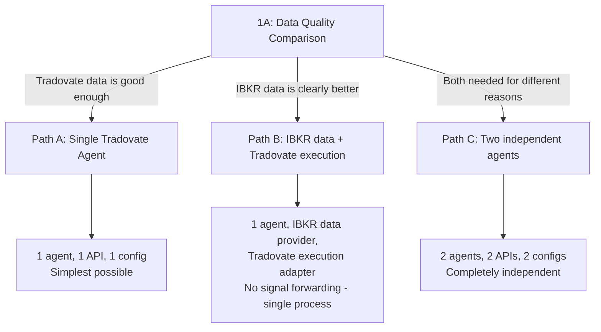
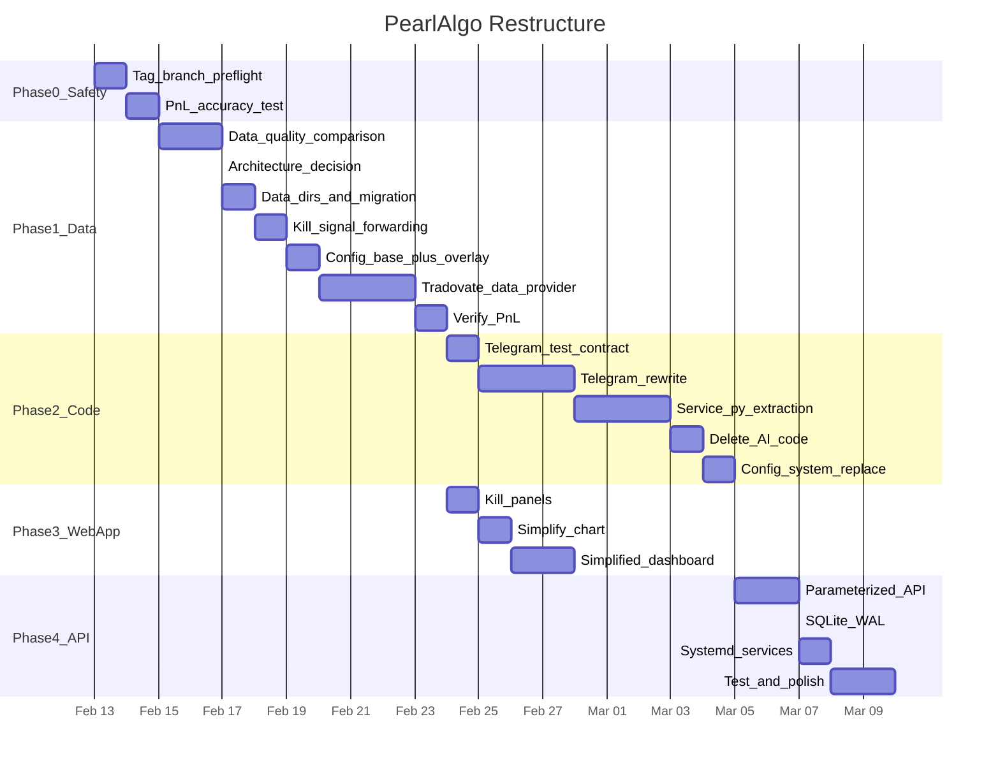

# PearlAlgo Complete Restructure -- Final Plan

All 15 architectural decisions have been reviewed and locked in. This plan reflects your choices.

## Decision Summary

| # | Decision | Your Choice |
|---|----------|-------------|
| 1 | Config files | Base config + thin per-account overrides (DRY) |
| 2 | Charting | Keep lightweight-charts, simplify to ~500 lines |
| 3 | API servers | One api_server.py parameterized by --data-dir and --port |
| 4 | Config validation | Lightweight Pydantic model (~100 lines) |
| 5 | Telegram handler | Ground-up rewrite to ~1,150 lines |
| 5B | Service.py | Incremental extract-and-test (this is the money code) |
| 6 | AI deletion | git tag pre-ai-deletion, then delete everything |
| 7 | ML code | Keep learning/ in shadow mode, delete pearl_ai + knowledge + ai |
| 8 | Telegram tests | Behavioral test contract BEFORE the rewrite |
| 9 | P&L test | Hand-calculated accuracy test BEFORE Phase 1 |
| 10 | Orphaned tests | Delete alongside source code, every commit passes |
| 11 | Coverage | Ratchet 65% -> 50% during restructure -> 70% after |
| 12 | Agent count | Build for 2 active agents, easy to add more later |
| 13 | Broker data | Test IBKR vs Tradovate data quality first, then decide |
| 14 | Telegram arch | One handler, routes to agent(s) via API (HTTP) |
| 15 | SQLite | WAL mode (one PRAGMA) |

---

## Phase 0: Safety Net (Day 1)

### 0A. Backup and Branch

- `git tag pre-restructure-v1` on current HEAD
- `git checkout -b restructure/phase-1`
- Preflight: `pytest tests/ -x` and `cd pearlalgo_web_app && npm run build`

### 0B. P&L Accuracy Test (Decision #9)

Write `tests/test_pnl_accuracy.py` BEFORE any restructure work:

```python
# Hand-calculated trade scenarios with known expected P&L
# MNQ = $2/tick, 4 ticks/point = $0.50/tick... actually $0.50 per 0.25 point
# So 1 MNQ point = $2.00
#
# Scenario 1: Long 1 MNQ at 17500.00, exit at 17510.00 = +$20.00
# Scenario 2: Short 3 MNQ at 17600.00, stop at 17620.00 = -$120.00
# Scenario 3: Long 5 MNQ at 17450.00, exit at 17475.00 = +$250.00
# Net P&L: +$150.00
```

- Run against current code to establish baseline
- Run after every phase to verify P&L math stays correct
- This is the acceptance test for the entire restructure

### 0C. Lower Coverage Threshold (Decision #11)

Change `pytest.ini`: `--cov-fail-under=50` (from 65). Will ratchet back up to 70 when done.

---

## Phase 1: Data Architecture -- Test First, Then Decide (Week 1)

### 1A. IBKR vs Tradovate Data Quality Comparison (Decision #13)

Before committing to a broker architecture, run a concrete comparison:

**Write `scripts/testing/compare_data_quality.py`:**
- Connect to IBKR Gateway, fetch 500 bars of MNQ 1m data
- Connect to Tradovate API, fetch 500 bars of MNQ 1m data for the same time window
- Compare:
  - Candle accuracy: Do OHLC values match within tick tolerance?
  - Latency: How quickly do new bars arrive after close?
  - Gaps: Any missing bars on either side?
  - Volume: Do volumes match?
- Output a report showing which source is more reliable

**Why this matters:** If IBKR data is significantly better, the architecture needs IBKR for data + Tradovate for execution (a more complex design). If they're equivalent, consolidate to one Tradovate agent (the simplest possible design).

### 1B. Architecture Decision Gate

Based on 1A results, one of three paths:



**Path A (Tradovate data good enough) -- simplest:**
- One agent: Tradovate data + Tradovate execution
- Archive IBKR Virtual performance data to `data/archive/ibkr_virtual/`
- One config, one API server, one data directory
- Delete IBKR-specific code paths if unused

**Path B (IBKR data clearly better) -- medium complexity:**
- One agent: IBKR data provider + Tradovate execution adapter
- NOT signal forwarding -- a single agent process that reads IBKR candles and sends orders to Tradovate
- This is architecturally clean: one process, one strategy, two broker connections
- Requires separate client IDs (data vs execution), which the config already supports

**Path C (two agents needed) -- current plan:**
- Two independent agents, each with own data source + execution
- More operational overhead but maximum independence

### 1C. Data Directory Setup

Regardless of path chosen, create clean data directories:

```
data/
  tradovate/
    paper/          # Active prop firm account
      state.json
      performance.json
      signals.jsonl
      trades.db
  archive/
    ibkr_virtual/   # Preserved IBKR Virtual history (read-only)
      performance.json
      signals.jsonl
      trades.db
```

If Path C (two agents): also create `data/ibkr/paper/`.

Update [src/pearlalgo/utils/paths.py](src/pearlalgo/utils/paths.py) to resolve state directories from config.

### 1D. Kill Signal Forwarding

Regardless of which path is chosen, signal forwarding dies:

- Delete [src/pearlalgo/market_agent/signal_forwarder.py](src/pearlalgo/market_agent/signal_forwarder.py) (275 lines)
- Remove `SignalForwarder` imports/usage from [service.py](src/pearlalgo/market_agent/service.py) and [signal_orchestrator.py](src/pearlalgo/market_agent/signal_orchestrator.py)
- Delete `data/shared_signals.jsonl` and `data/shared_signals.jsonl.lock`
- Remove `signal_forwarding` section from all configs
- Delete `tests/test_signal_forwarder.py` (430 lines) and `tests/test_signal_forwarder_failures.py` (141 lines) in the same commit

### 1E. Config System (Decisions #1 and #4)

**Base config + thin per-account overrides:**

```
config/
  base.yaml                  # Shared strategy, risk, signals (~200 lines)
  accounts/
    tradovate_paper.yaml     # Account-specific: execution adapter, ports, data provider (~30-50 lines)
    ibkr_paper.yaml          # Only if Path B or C
```

`base.yaml` contains everything shared: strategy params, risk settings, signal thresholds, circuit breaker rules, data buffer sizes.

Account files contain ONLY what differs: `execution.adapter`, `execution.enabled`, `data_provider`, port numbers, client IDs, challenge settings.

**Lightweight Pydantic model:**

Replace the 6-file / 2,309-line config system with:

```
src/pearlalgo/config/
  __init__.py
  loader.py     # ~50 lines: load base.yaml, merge account overlay, return validated config
  schema.py     # ~100 lines: one flat Pydantic model, validates types, provides defaults
```

Agent startup: `python -m pearlalgo.market_agent.main --config config/accounts/tradovate_paper.yaml --data-dir data/tradovate/paper`

`loader.py` reads `base.yaml`, deep-merges the account file on top, passes the merged dict to `AccountConfig(**merged)` for Pydantic validation.

### 1F. Tradovate Data Provider (If Needed)

Only if Phase 1B selects Path A or Tradovate data is needed:

Create `src/pearlalgo/data_providers/tradovate/tradovate_provider.py` implementing `DataProvider` ABC from [base.py](src/pearlalgo/data_providers/base.py). Reuse `TradovateClient` from [src/pearlalgo/execution/tradovate/client.py](src/pearlalgo/execution/tradovate/client.py) for WebSocket connection, extend with market data subscription.

Update [factory.py](src/pearlalgo/data_providers/factory.py): `create_data_provider("tradovate")`.

### 1G. Verify

- Run `test_pnl_accuracy.py` -- must pass
- Start agent(s), confirm independent operation
- Confirm P&L numbers match expected values

---

## Phase 2: Code Simplification (Week 2)

### 2A. Telegram Behavioral Test Contract (Decision #8)

BEFORE rewriting any Telegram code, write `tests/test_telegram_contract.py` with ~15-20 tests:

```python
# Required behaviors the new handler MUST support:
# 1. /status returns agent state, P&L, positions (via API call)
# 2. /trades returns recent trades
# 3. /stop triggers agent stop (via POST /control)
# 4. Kill switch works
# 5. Unauthorized chat_id gets rejected
# 6. Messages over 4096 chars get split
# 7. Rate-limited calls (429) retry with exponential backoff
# 8. Callback query expiration handled gracefully
# 9. MessageNotModified errors handled (user clicks same button twice)
# 10. HTML entities in trade data are escaped
# 11. /help returns command list
# 12. Account switching works (if multiple agents)
# 13. Start/stop buttons in inline keyboard
# 14. P&L formatting is correct (currency, sign, color)
# 15. Error responses don't crash the handler
```

### 2B. Telegram Ground-Up Rewrite (Decision #5)

Delete all 12 existing telegram files (~12,595 lines). Build new:

```
src/pearlalgo/telegram/
  __init__.py
  main.py               # ~100 lines: router, handler registration, startup
  handlers/
    __init__.py
    status.py            # ~200 lines: agent status, P&L, positions (calls GET /status)
    trading.py           # ~150 lines: start/stop, kill switch (calls POST /control)
    analytics.py         # ~200 lines: performance stats, charts
    config.py            # ~100 lines: config viewing
  formatters/
    __init__.py
    messages.py          # ~200 lines: message formatting, HTML escaping, splitting
    keyboards.py         # ~150 lines: inline keyboard builders
  utils.py               # ~50 lines: auth check, safe_send with retry, rate limit handling
```

**Key architecture (Decision #14):** The Telegram handler is a thin UI layer. It does NOT read state files or talk to agents directly. It calls the agent's API server via HTTP:

```python
# handlers/status.py
async def handle_status(update, context):
    api_url = context.bot_data["api_url"]  # e.g., "http://localhost:8001"
    resp = await httpx.get(f"{api_url}/status")
    data = resp.json()
    msg = format_status_message(data)
    await update.message.reply_html(msg)
```

Delete old telegram tests (12 files, ~7,200 lines) in the same commit as old source. New tests from 2A validate the new code.

### 2C. Service.py Incremental Extraction (Decision #5B)

This is the code that manages money. Move carefully, one concern at a time:

**Step 1:** Extract `service_lifecycle.py` -- `start()`, `stop()`, `_shutdown()`, signal handlers, reconnection logic. Test after extraction.

**Step 2:** Extract `service_loop.py` -- main scan loop, data fetching, signal processing per-tick. Test after extraction.

**Step 3:** Extract `service_config.py` -- the ~200 lines of config wiring currently in `__init__`. Test after extraction.

Target: `service.py` drops from 4,184 to ~1,500 lines. Each extraction is its own commit. Run `test_service_core.py`, `test_service_loop_failures.py`, `test_service_high_risk_methods.py`, `test_service_pause.py` after each step.

### 2D. Delete AI/LLM Code (Decisions #6 and #7)

**Step 1:** `git tag pre-ai-deletion`

**Step 2:** Delete in one commit:
- `src/pearlalgo/pearl_ai/` (10,409 lines)
- `src/pearlalgo/knowledge/` (671 lines)
- `src/pearlalgo/ai/` (925 lines)
- `scripts/knowledge/` (3 files)
- `data/knowledge_index/`
- `.github/workflows/eval.yml`
- Pearl AI eval datasets
- Remove `openai`, `anthropic` from optional deps in `pyproject.toml`
- Remove Pearl AI router mount from `api/server.py`
- Remove all `ai_chat`, `ai_briefings`, `knowledge` config sections

**In the same commit, delete orphaned tests (Decision #10):**
- `test_pearl_brain.py`, `test_pearl_api_router.py`, `test_pearl_llm_claude.py`, `test_pearl_tools.py`, `test_pearl_cache.py`, `test_ai_chat.py`, `test_shadow_tracker.py`, `test_knowledge_indexer.py`, `test_pearl_metrics.py`, `test_pearl_config_defaults.py`, `test_pearl_request_dedupe.py`

**Keep (Decision #7):**
- `src/pearlalgo/learning/` -- ML signal filter in shadow mode, free data collection
- `models/signal_filter_v1.joblib`
- `tests/test_ml_*.py`, `tests/test_feature_engineer.py`, `tests/test_bandit_policy.py`

### 2E. Config System Replacement (Decisions #1 and #4)

Delete the old 6-file config system (2,309 lines):
- `config_file.py`, `config_loader.py`, `config_schema.py`, `config_view.py`, `adapters.py`, `defaults.py`, `settings.py`

Delete orphaned config tests in the same commit:
- `test_config_adapters.py`, `test_config_defaults.py`, `test_config_defaults_consistency.py`, `test_config_file.py`, `test_config_helpers.py`, `test_config_loader.py`, `test_config_schema.py`, `test_config_wiring.py`, `test_settings_precedence.py`

Replace with new `loader.py` (~50 lines) + `schema.py` (~100 lines). Write new `test_config.py` (~200 lines) covering: load + merge, type validation, missing required keys, defaults, unknown keys warning.

---

## Phase 3: Web App Simplification (Week 2-3)

### 3A. Kill Panels

Delete from `pearlalgo_web_app/components/`:
- `AnalyticsPanel.tsx` (402 lines)
- `PearlInsightsPanel.tsx` (1,589 lines)
- `SystemHealthPanel.tsx` (254 lines)
- `SignalDecisionsPanel.tsx` (166 lines)
- `AuditPanel.tsx` (1,159 lines)
- `PostTradesPanels.tsx` (92 lines)
- `HelpPanel.tsx` (90 lines)
- `MarketContextPanel.tsx` (272 lines)
- `RiskEquityPanel.tsx` (320 lines)
- `ConfigPanel.tsx` (94 lines)
- `DataPanelsContainer.tsx` (125 lines)
- `UltrawideLayout.tsx` (88 lines)

Remove all associated hooks, stores, types, and API calls used only by deleted panels. Remove corresponding imports from `page.tsx`.

### 3B. Simplify Chart (Decision #2)

Keep `CandlestickChart.tsx` (lightweight-charts) but strip from 1,109 to ~500 lines:
- Keep: candlesticks, volume, EMA9/21, VWAP, position lines, session shading, trade markers
- Remove: dead overlay code, unused indicator configs, overly complex tooltip logic
- Remove indicator overlay components if unused after panel deletion

### 3C. Simplified Dashboard

Final component set:

```
pearlalgo_web_app/components/
  CandlestickChart.tsx     # ~500 lines (simplified)
  TradeDockPanel.tsx       # ~808 lines (positions + recent trades -- keep as-is)
  PearlHeaderBar.tsx       # ~224 lines (account, P&L, status)
  SystemStatusPanel.tsx    # ~320 lines (readiness, kill switch, controls)
  ChallengePanel.tsx       # ~296 lines (prop firm eval status -- keep if active)
```

Rewrite `page.tsx` from 941 to ~200 lines:

```
+-- Header: Account | P&L | Status | Kill Switch ---+
|                                                     |
|            Chart (lightweight-charts, full width)   |
|                                                     |
+-----------------------------------------------------+
|  Positions & Trades          | Challenge Status     |
|  (TradeDockPanel)            | (ChallengePanel)     |
+-----------------------------------------------------+
```

---

## Phase 4: API Cleanup (Week 3)

### 4A. Parameterized API Server (Decision #3)

Replace the current multi-file API setup with one `api_server.py` that takes `--data-dir` and `--port`:

```bash
python api_server.py --data-dir data/tradovate/paper --port 8001
```

Simplified endpoints (from current 20+ to 4 core):

```
GET  /status         # Agent status, P&L, open positions
GET  /chart/{tf}     # OHLCV candles for timeframe
GET  /trades         # Recent trades (last 50)
POST /control        # Start/stop/kill-switch/flatten
```

Keep `data_layer.py` as the reader (simplified to read from `--data-dir`).

Delete:
- `audit_router.py`, `indicator_service.py`, `tradovate_helpers.py`, `metrics.py`
- All Pearl AI API endpoints
- WebSocket complexity (Telegram handler polls the API instead)

### 4B. SQLite WAL Mode (Decision #15)

Verify WAL is enabled. If not, add to connection setup:

```python
conn.execute("PRAGMA journal_mode=WAL")
```

### 4C. Systemd Services

Update systemd for the final architecture. If single agent (Path A):

```
scripts/systemd/
  pearlalgo-agent.service           # python -m pearlalgo.market_agent.main --config ... --data-dir ...
  pearlalgo-api.service             # python api_server.py --data-dir ... --port 8001
  pearlalgo-telegram.service        # python -m pearlalgo.telegram.main
  pearlalgo-webapp.service          # Next.js
  ibkr-gateway.service              # Only if Path B (IBKR data)
```

### 4D. Test and Polish

- Run `test_pnl_accuracy.py` -- must pass
- Run full `pytest` suite -- must pass at 50%+ coverage
- Ratchet `--cov-fail-under` to 70%
- Manual verification: start agent, observe trades, check P&L matches broker
- `cd pearlalgo_web_app && npm run build` -- must pass

---

## Execution Timeline



Phase 2 (Python backend) and Phase 3 (Web app) can run in parallel -- they touch different codepaths.

---

## Deletion Summary

| Category | Lines Removed |
|---|---|
| Signal forwarder + tests | ~846 |
| Telegram handler + mixins + notifier + tests | ~19,795 |
| Pearl AI + knowledge + ai + tests | ~15,684 |
| Config system (6 files) + tests | ~4,571 |
| Web app panels (12 components) | ~4,651 |
| API complexity (audit, metrics, etc.) | ~1,000 |
| **Total removed** | **~46,547 lines** |

| Category | Lines Added |
|---|---|
| New telegram modules | ~1,150 |
| Telegram behavioral tests | ~500 |
| P&L accuracy test | ~200 |
| New config loader + schema + tests | ~350 |
| Tradovate data provider (if needed) | ~300 |
| New config files (base + overlays) | ~300 |
| **Total added** | **~2,800 lines** |

**Net reduction: ~43,700 lines.**

---

## Key Principles (From Your Engineering Preferences)

- **DRY**: Base config + overlays, one parameterized API server, no code duplication
- **Well-tested**: P&L accuracy test first, behavioral contract before Telegram rewrite, tests deleted alongside source
- **Engineered enough**: Lightweight Pydantic (not raw dicts, not 587-line schema), incremental service.py extraction (not rewrite)
- **More edge cases, not fewer**: Keep learning/ML in shadow mode, WAL for SQLite, test-driven Telegram rewrite
- **Explicit over clever**: One agent process per account, HTTP routing for Telegram, no env-var substitution magic
