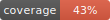
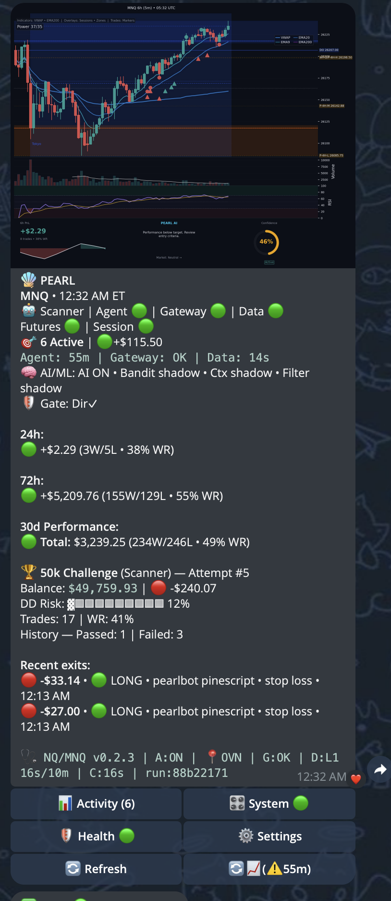

# PearlAlgo Market Trading Agent



Production-ready market trading agent with a modular architecture:
data providers (IBKR), strategy/signal generation with aggressive entry triggers, state + metrics, Telegram UI,
and execution via Tradovate.

## Pearl Algo Web App (Telegram + Mini App)



See `docs/PEARL_WEB_APP.md` for Mini App setup (public HTTPS required) and screenshot capture.
The canonical frontend lives in `apps/pearl-algo-app/`.

## Quick start (local)

### Prereqs

- Python **3.12+**
- IBKR Gateway reachable (see `docs/GATEWAY.md`)
- Telegram bot credentials (see `env.example`)

### Install

```bash
cd ~/projects/pearl-algo
python3 -m venv .venv
source .venv/bin/activate
pip install -e ".[dev]"
```

### Configure

```bash
cp env.example .env
# Edit .env with TELEGRAM_* and IBKR_* values
```

Service behavior is configured in `config/live/tradovate_paper.yaml` (use `--config config/live/tradovate_paper.yaml` when starting the agent).

Strategy parameters (EMA periods, entry triggers, confidence thresholds) are configured under `strategies.composite_intraday` in `config/live/tradovate_paper.yaml`.

### Run (operator scripts)

```bash
# Audit the live runtime layout first after a revamp
python3 scripts/ops/audit_runtime_paths.py

# Start everything
./pearl.sh start

# One-line health check
./pearl.sh quick

# Start without the chart if needed
./pearl.sh start --no-chart

# Tradovate Paper only
./pearl.sh tv_paper status
```

## Validation

```bash
# Unit tests (pytest)
./scripts/testing/run_tests.sh

# Validation runner (telegram/signals/service/arch)
python3 scripts/testing/test_all.py

# Type checking (mypy)
mypy src/pearlalgo

# Coverage + badge
make coverage
```

### Convenience (Makefile)

```bash
# Install deps (editable) + dev tooling
make install

# Run the same checks CI runs locally
make ci

# Pearl AI prompt eval (mock mode)
make eval

# Optional: dependency vulnerability scan
make audit
```

### CI

GitHub Actions workflow lives at `.github/workflows/ci.yml` and runs:
- Unit tests (skipping IBKR / Telegram-credential tests)
- Architecture boundary enforcement
- Secret scan on tracked files
- Multi-market config + state isolation smoke test

CI runs tests, linting, type checking, and architecture boundary checks via `.github/workflows/ci.yml`.

## Docs (start here)

- `docs/START_HERE.md`
- `docs/CURRENT_OPERATING_MODEL.md`
- `docs/PATH_TRUTH_TABLE.md`
- `docs/COMPATIBILITY_SURFACES.md`
- `docs/GATEWAY.md`
- `docs/TESTING_GUIDE.md`

## TradingView indicators

TradingView Pine scripts live under `resources/pinescript/`.
