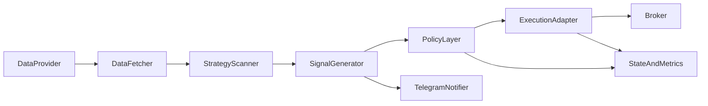

## Architecture (Platform View)

This codebase is intentionally layered to keep the “core” stable while adapters evolve.

### Core flow (runtime)

### Package boundaries (why they matter)

Your `pyproject.toml` already enforces layer rules via **import-linter**. This is the right direction for a “forever codebase” because it prevents accidental coupling.

- `pearlalgo.utils`: pure helpers (should not import higher layers)
- `pearlalgo.config`: loading + settings (should not depend on higher layers)
- `pearlalgo.data_providers`: market data (should not depend on strategies/agent)
- `pearlalgo.strategies`: signal generation logic (should not depend on data providers/agent)
- `pearlalgo.execution`: broker adapters (should not depend on strategies/learning/agent)
- `pearlalgo.learning`: models/policies (should not depend on runtime orchestration)
- `pearlalgo.nq_agent`: orchestration + state + ops

### Where we should converge (target architecture)

To keep scaling clean, we want **one canonical place** for each concern:

- **Signal policy** (filters, regime rules, thresholds): one engine used everywhere
- **Risk policy** (stops + sizing + risk caps): one engine used everywhere
- **State persistence**: one store (ideally SQLite) instead of multiple JSON files

### Extension points (how we grow forever)

- **New strategy**: add a strategy module that produces the same normalized signal schema
- **New broker**: add an execution adapter (IBKR/Tradovate/…)
- **New ML model**: add a learner that plugs into the policy layer (never directly into the agent loop)

