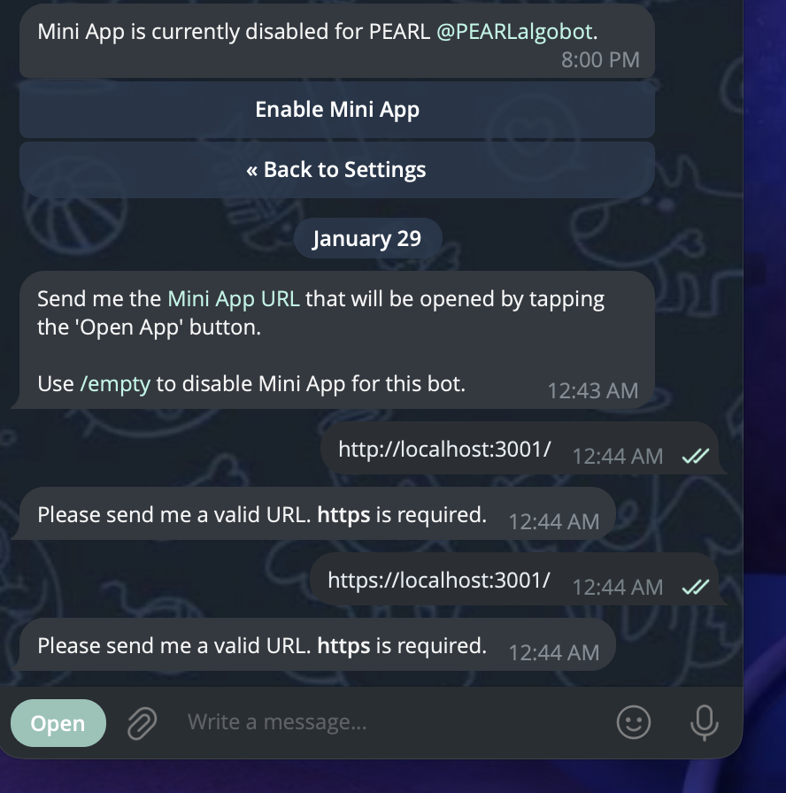

# Pearl Algo Web App + Telegram Mini App

This repo's **canonical chart** is the web-based **Pearl Algo Web App** (`pearlalgo_web_app/`).

It powers:
- A **browser dashboard** (local or deployed)
- A **Telegram dashboard screenshot** (`exports/dashboard_telegram_latest.png`)
- A **Telegram Mini App** (in-app "web_app" view)


---

## Prerequisites

**Node.js 20.x** is required for the Next.js 14 chart:

```bash
# Ubuntu/Debian
curl -fsSL https://deb.nodesource.com/setup_20.x | sudo -E bash -
sudo apt-get install -y nodejs

# Verify
node --version  # v20.x.x
```

---

## Architecture

```
┌─────────────────┐      ┌──────────────────┐      ┌─────────────┐
│  Next.js        │◄────►│  FastAPI Server  │◄─────┤ IBKR        │
│  Frontend       │  WS  │  (Port 8000)     │      │ Gateway     │
│  (Port 3001)    │      │                  │      │ (Port 4002) │
└─────────────────┘      └──────────────────┘      └─────────────┘
        │                         │
        ▼                         ▼
   Zustand Stores           WebSocket Broadcast
   (agentStore,             (real-time updates)
    chartStore,
    uiStore)
```

---

## Features

| Feature | Description |
|---------|-------------|
| **Timeframe Selector** | Switch between 1m, 5m, 15m, 1h (header buttons) |
| **Dynamic Viewport** | Bar count adjusts to screen width automatically |
| **Fit All / Go Live** | Quick buttons (top-right) to fit all data or jump to live edge |
| **Indicators** | EMA9 (cyan), EMA21 (yellow), VWAP (purple dashed) |
| **RSI Panel** | Separate RSI(14) panel with overbought/oversold lines |
| **Trade Markers** | Entry arrows and Exit dots with hover tooltips showing signal details |
| **WebSocket Updates** | Real-time state updates via WebSocket (2-second broadcast) |
| **Error Boundaries** | Graceful component failure handling |
| **API Authentication** | Optional API key authentication for protected endpoints |

---

## Components

### 1. FastAPI API Server (`scripts/pearlalgo_web_app/api_server.py`)
- **Port**: 8000 (default)
- **IBKR Client ID**: 88 (configurable via `IB_CLIENT_ID_LIVE_CHART`)
- **Endpoints**:
  - `GET /api/candles` - OHLCV candle data
  - `GET /api/indicators` - EMA9, EMA21, VWAP, RSI
  - `GET /api/markers` - Trade entry/exit markers (authenticated)
  - `GET /api/state` - Agent state with full system health (authenticated)
  - `GET /api/trades` - Recent trades (authenticated)
  - `GET /api/analytics` - Session analytics (authenticated)
  - `GET /api/market-status` - Market open/closed status
  - `WS /ws` - WebSocket for real-time updates
  - `GET /health` - Health check

### 2. Next.js Frontend (`pearlalgo_web_app/`)
- **Port**: 3001 (default)
- **Framework**: Next.js 14 with TypeScript
- **Chart Library**: Lightweight Charts (TradingView)
- **State Management**: Zustand stores
- **Features**:
  - Real-time WebSocket updates
  - Fallback HTTP polling when WebSocket disconnected
  - Multiple data panels (Performance, Risk, Analytics, System Health)
  - Error boundaries for graceful failures

---

## Local run (dev)

Start API server + Next.js chart:

```bash
./pearl.sh webapp start
# or
./pearl.sh webapp restart
```

Open the chart:
- `http://localhost:3001`

Stop:

```bash
./pearl.sh webapp stop
```

---

## State Management

The app uses Zustand stores for centralized state:

| Store | Purpose |
|-------|---------|
| `useAgentStore` | Agent state, performance, trades, analytics |
| `useChartStore` | Candles, indicators, markers, timeframe |
| `useUIStore` | WebSocket status, theme, notifications |

---

## API Authentication (Optional)

Enable API key authentication for protected endpoints:

```bash
# Enable authentication
export PEARL_API_AUTH_ENABLED=true

# Set API key (or auto-generates one)
export PEARL_API_KEY=your-secret-key

# Frontend API key
export NEXT_PUBLIC_API_KEY=your-secret-key
```

Protected endpoints require `X-API-Key` header or `api_key` query parameter.

---

## Telegram dashboard screenshot (optional)

The Market Agent Service + Telegram Command Handler will attach a PNG screenshot stored at:

- `data/agent_state/<MARKET>/exports/dashboard_telegram_latest.png`

Screenshot capture requirements:

```bash
pip install playwright
playwright install chromium
```

Runtime env:
- **`PEARL_LIVE_CHART_URL`**: URL that Playwright will screenshot (default `http://localhost:3001`)

---

## Telegram Mini App ("Open App" stays inside Telegram)

Telegram requires a **public HTTPS URL** (BotFather rejects `localhost`).



### Option A: Quick Tunnel (ephemeral, for testing)

```bash
cloudflared tunnel --url http://localhost:3001
```

This gives you a random URL like `https://xxx-yyy-zzz.trycloudflare.com` (changes each run).

### Option B: Named Tunnel (persistent, for production)

A named tunnel gives you a **persistent HTTPS URL** that survives restarts.

See cloudflared tunnel setup documentation for details.

---

## Environment Variables

| Variable | Default | Description |
|----------|---------|-------------|
| `PEARL_LIVE_CHART_URL` | `http://localhost:3001` | URL for Playwright screenshot capture |
| `PEARL_MINI_APP_URL` | *(unset)* | Public HTTPS URL shown as "📈 Live" button |
| `PEARL_API_PORT` | `8000` | API server port |
| `PEARL_CHART_PORT` | `3001` | Chart web interface port |
| `PEARL_LIVE_CHART_ORIGINS` | *(unset)* | CORS origins for API (comma-separated) |
| `PEARL_API_AUTH_ENABLED` | `false` | Enable API authentication |
| `PEARL_API_KEY` | *(auto-gen)* | API key for protected endpoints |
| `NEXT_PUBLIC_API_KEY` | *(unset)* | Frontend API key |

---

## Testing

Run the test suite:

```bash
cd pearlalgo_web_app
npm test              # Run all tests
npm run test:watch    # Watch mode
npm run test:coverage # With coverage
```

---

## Troubleshooting

### Chart shows "No Data"
Ensure:
1. Market Agent is running (`./pearl.sh status`)
2. IBKR Gateway is connected (`./pearl.sh gateway status`)
3. API server is running (check `http://localhost:8000/health`)

### WebSocket not connecting
1. Check API server logs for WebSocket errors
2. Verify port 8000 is accessible
3. Check browser console for connection errors

---

**Last Updated**: 2026-01-31
**Maintainer**: PEARLalgo Development Team
