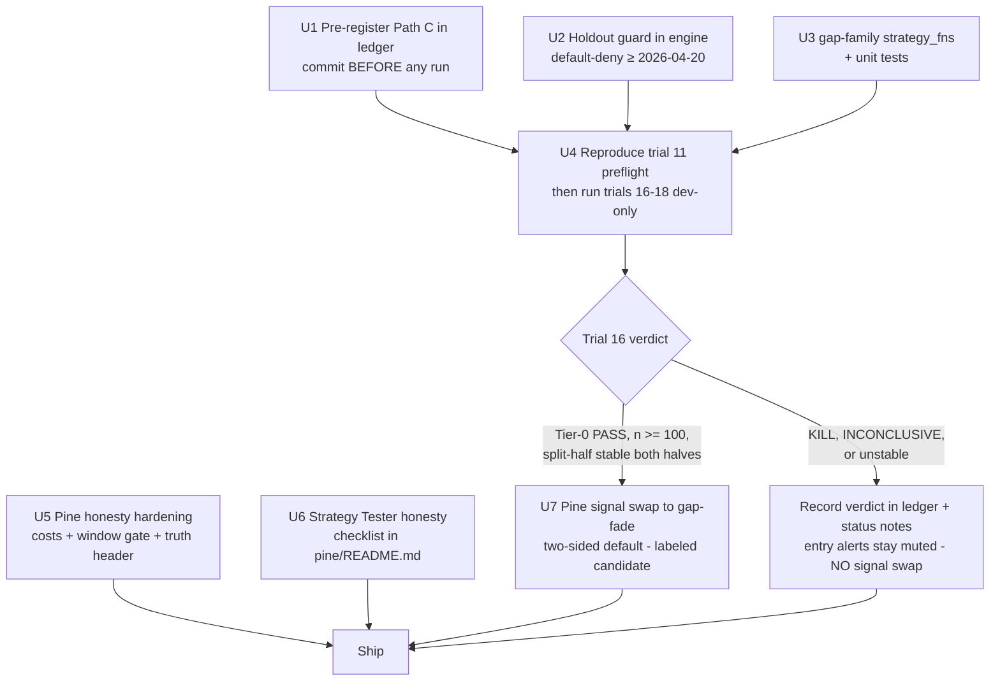

# feat: Pre-registered overnight-gap family (Path C) + Pine Strategy Tester honesty hardening

**Target repo:** `pearl-algo` (manual TradingView-alert toolkit — automated trading stays dormant)

## Summary

The EMA9/21+VWAP signal in `pine/mnq_rth_long_bias.pine` is KILLED (trial 11: −4.46 pt/trade, n=152, dev-clean — `docs/audits/validation-trial-ledger.md`), yet the Pine script still alerts on it and its Strategy Tester models **zero commission and zero slippage**. This plan (a) pre-registers a genuinely different signal family — **overnight-gap conditioning** ("Path C") — and runs it through the existing Tier-0/Tier-1 validation ladder on the dev window only, and (b) hardens the Pine script and its docs so TradingView's Strategy Tester can never again flatter a signal with cost-free fills. The Pine signal is replaced **only if** the new family survives both Tier-0 and the Tier-1 split-half; on a KILL (the base-rate-likely outcome: 13 of 15 prior trials died), the honesty hardening still ships and the kill is recorded.

---

## Problem Frame

- The manual toolkit's only signal source is a killed strategy. The script header says "unproven"; the truth is "disproven."
- The Strategy Tester is the operator's "first, free backtest" (per `pine/README.md`), but with no `commission_value`/`slippage` in the `strategy()` declaration it reports gross-of-cost results — exactly the error the local engine fixed on 2026-06-03 (commit `d88db45`), which invalidated all prior Phase-E numbers.
- Every signal family tried so far is dead: EMA/VWAP cross, RICH composite, ORB, VWAP-band reversion (trials 7–11), opening-drive, unconditional RTH long, overnight short (trials 12–15). The ledger's own directive: the next hypothesis must be *genuinely different*, pre-registered, dev-window-only.
- The ledger declares "the harness must refuse to load held-out dates outside the Tier-5 run" — but no such enforcement exists in `scripts/ops/backtest_config.py`. Held-out discipline is convention-only today.

## Requirements

- **R1 — Genuinely different family.** The proposal's conditioning variable (overnight session return / opening gap) appears nowhere in trials 7–15. No EMA, no VWAP, no opening-range breakout, no unconditional time-of-day bet.
- **R2 — Pre-registered.** The full trial spec (definitions, thresholds, directions, exits, window, commands) is committed to the validation ledger **before** any trial runs. DSR `n_trials` increments 15 → 18.
- **R3 — Dev-window only; held-out untouched.** All runs use `--start 2025-10-26 --end 2026-04-19`. The held-out slice (2026-04-20 → 2026-06-03) is not loaded. The engine gains a default-deny holdout guard so this is enforced, not promised.
- **R4 — Strategy Tester honesty checklist.** Realistic commission/slippage modeled in the `strategy()` declaration; stops/targets frozen (structure-derived, never Tester-tuned); repainting checks documented and passed; a written verification checklist the operator runs before trusting any Tester report.
- **R5 — Manual toolkit preserved; nothing re-armed.** No changes to `config/live/`, execution switches, or anything that could start automated order flow. Alert → human → manual MFF order remains the only path.
- **R6 — Honest failure mode.** If the family KILLs, the Pine signal is **not** swapped; the kill is recorded in the ledger and surfaced in the script/README status notes. Killed signals are never shipped to the manual toolkit.

## Assumptions

(Headless-run inferences; each is a bet the operator can veto — U1's pre-registration commit is the natural veto point before any trial runs.)

1. **Family choice is the agent's call.** Overnight-gap conditioning was selected over alternatives (order-flow: needs sub-minute data we don't have; daily mean-reversion: ~30–50 trades on a 118-session dev window is too small to read; volatility-compression breakout: too close to the killed ORB family). Grounding: external evidence synthesis (see Sources).
2. **Implementation includes running the trials.** `backtest_config.py` is a local, read-only replay of `data/candles.db` — running it is part of "implement," not a live-system action.
3. **Tier-1 split-half is mandatory for any Tier-0 survivor.** The opening-drive precedent (trials 12–13 passed Tier-0, died at split-half) makes Tier-0-only promotion dishonest.
4. **Data integrity is verified by reproduction, not trust.** `data/candles.db` has WAL activity newer than the 2026-06-03 frozen snapshot; before any new trial, trial 11 is re-run verbatim and must reproduce (n=152, −4.46 pt/trade) to prove engine+data are unchanged on the dev window.
5. **Cost figures are current as of 2025-11-13** (NinjaTrader/Tradovate fee schedule). A possible CME fee change effective April 2026 for equity micros is flagged but unverified; the chosen Pine cost settings are deliberately at/above the engine's assumption, so drift is in the conservative direction.

---

## Key Technical Decisions

### KTD-1: The new family is overnight-gap conditioning, size-stratified

At the RTH open (09:30 ET), condition on the overnight gap — `gap = today's RTH open − prior day's RTH close`. Caveat: the archive is an unadjusted spliced continuous series, so on contract-roll boundaries (quarterly; ~mid-Dec 2025 and ~mid-Mar 2026 both fall inside the dev window) this difference includes the calendar spread — a phantom gap that never economically existed, and exactly where back-adjusted TradingView charts disagree with the archive. Roll-adjacent sessions are identified before any run and pre-registered as excluded from all three trials (U1); any Pine implementation mirrors the same exclusion. External evidence is **size-regime-dependent and points opposite ways**: small gaps (<0.3× daily ATR) fill ~78% of the time on NQ (2015–2025, n=2,791 sessions); large gaps (>1.2× ATR) fill only ~8% (i.e., continue); unconditional all-gaps fade has only a WEAK prior (~60% fill, thin-to-negative after costs). The pre-registration therefore stratifies by size with directions fixed from this external prior — never fitted to our data. The conditioning variable is genuinely new to the program (R1): trials 7–15 used indicator crosses, range breakouts, band fades, and unconditional clock bets; none used the overnight session return.

### KTD-2: Pre-registration shape — one primary, two secondaries, frozen spec

Mirrors the committed Path-B pattern (1 primary + secondaries + family-wise bias disclosure). Three trials, numbered 16–18, DSR `n_trials` 15 → 18:

| Trial | Name | Condition (at first RTH bar close) | Direction | Exit |
|---|---|---|---|---|
| 16 (PRIMARY) | `gap_fade_small` | 5.0 pt ≤ \|gap\| ≤ 0.30 × ATR_d(14) | against gap sign | target = prior RTH close (gap fill); stop = entry ± remaining-distance (1:1 R); max-hold to RTH close |
| 17 (secondary) | `gap_fade_all` | \|gap\| ≥ 5.0 pt (no ceiling) | against gap sign | same structural exits |
| 18 (secondary) | `gap_continue_large` | \|gap\| ≥ 0.70 × ATR_d(14) | with gap sign | sentinel hold to RTH close (Path-B `_HOLD_SENTINEL` convention — pure conditional-drift read) |

Frozen definitions: `prior RTH close` = close of the last 5m bar in [09:30, 16:00) ET on the most recent prior trading date. `ATR_d(14)` = Wilder ATR over daily aggregates (ET calendar date, full ETH range) of all bars strictly before today — no lookahead. Entry = close of the first RTH bar of the session (engine fires at signal-bar close, Path-B convention); skip the session if the gap has already filled by that close or the remaining distance to target is < 5.0 pt (the cost floor: target must clear ≥5× the ~1.0 pt RT cost). Fire at most once per session. Two-sided by design; the two-sided read is THE read (per-side breakdowns are diagnostics, never a promotion basis).

Additional frozen mechanics — closing every post-registration degree of freedom: ATR_d is valid only once 14 complete prior daily aggregates exist (earlier sessions fire nothing); the archive's first, possibly partial, calendar day is excluded from aggregates; a session whose prior trading date has no RTH bars fires nothing; contract-roll-adjacent sessions (pinned by date in U1) are excluded from all three trials. Expected qualifying-session counts per trial are derived in U1 from the dev window's gap-size/ATR_d distribution — conditioning variables only, no trade outcomes computed — so the registered spec discloses expected n before any backtest runs.

Honest disclosures baked into the ledger entry: trial 17 contains trial 16's trades (dilution test, pre-registered as such); trial 18's n will be small (~10–25) and is expected INCONCLUSIVE unless the effect is enormous; the family-wise chance of ≥1 false positive at nominal 95% across 3 trials is ≈14%; the small-gap fade prior is moderate, the all-gaps prior WEAK — both stated up front.

### KTD-3: Tier-0 + Tier-1 verdicts gate the Pine signal swap

The Pine entry logic changes **only if** trial 16 (the primary) clears ALL of the following, stated here and in the U1 ledger entry before any run:

1. **Tier-0 PASS with `undersized` false** (n ≥ 100) per the committed gate (`tier0_verdict` in `src/pearlalgo/validation/stats.py`). The gate's own docstring calls an undersized sample "a caveat, not a pass" — so a PASS with `undersized=true` routes to the record-only branch as INCONCLUSIVE, no Pine swap, absent an explicit ledger-recorded operator override.
2. **Tier-1 split-half stability** (H1 2025-10-26→2026-01-22 / H2 2026-01-23→2026-04-19, same halves as Path B): positive expectancy in **both** halves AND neither half carrying more than 70% of total profit — a two-way-split operationalization of the ledger's committed W13 concentration guard (the literal "any single regime > 40%" wording targets finer regime partitions; the deviation is acknowledged in the ledger entry).

Anything less → R6: record the verdict, don't ship the signal. On a full PASS, the swap ships the **validated two-sided configuration as the default** — up-gap fade shorts ON; disabling shorts departs from the validated read and the script must say so, because the long-only slice was never a promotion basis — labeled "candidate — paper-trade the gate before funded capital" (operator directive; nothing is "validated" by Tier-0/1 alone).

### KTD-4: Pine cost model — verified broker numbers, deliberately conservative

`commission_type = strategy.commission.cash_per_contract`, `commission_value = 0.95` (verified Tradovate/NinjaTrader free-tier all-in per side as of 2025-11-13: $0.39 commission + $0.35 CME exchange + $0.02 NFA + $0.19 clearing), `slippage = 1` (1 tick = $0.50, applied to market/stop fills; limit targets never slip), `backtest_fill_limits_assumption = 1` (no touch-fills on limit targets). Models $2.40–$2.90 per round trip — above the verified real broker cost (~$1.90 RT) and in line with the engine's modeled costs (1.0 pt ≈ $2 RT commission plus 0.25 pt adverse slippage per fill), which is the honest direction for a *manual* workflow (a human acting on a bar-close alert fills later and worse than the emulator).

### KTD-5: Engine-level holdout guard, default-deny

`backtest_config.py` refuses to include bars dated ≥ 2026-04-20 (ET) unless an explicit `--tier5-held-out` flag is passed. Convention becomes enforcement (R3), closing the gap between what the ledger promises and what the harness does. Trailing `--days` windows (which silently overlap the held-out slice — the trial 7–10 contamination mechanism) get clamped with a loud warning.

### KTD-6: No `request.security()` in the Pine implementation

Prior-RTH-close and daily-ATR are computed with chart-timeframe `var` state machines (session-boundary detection), eliminating the entire HTF-repaint class rather than mitigating it. The script keeps `calc_on_every_tick = false`, `process_orders_on_close = true`, `alert.freq_once_per_bar_close` — all already correct in the current file.

---

## High-Level Technical Design

Gated pipeline — pre-registration is committed before any run; the verdict routes the Pine work:

U5 and U6 are unconditional — they ship regardless of the verdict. Sequencing: U1 must be its own commit before U4 executes; U2/U3 are parallel-safe; U7 (or the record-only branch) is last.

---

## Implementation Units

### U1. Pre-register Path C in the validation ledger

**Goal:** An immutable, committed trial spec for trials 16–18 before any backtest runs (R2).

**Requirements:** R1, R2, R3.

**Dependencies:** none. **Must land as its own commit before U4 runs.**

**Files:** `docs/audits/validation-trial-ledger.md`

**Approach:** Append a "Path C — overnight-gap conditioning (pre-registered 2026-06-12)" section mirroring the Path-B structure: motivation (why this family is genuinely different from everything in trials 7–15), the frozen definitions and trial table from KTD-2, the external-prior citations with honest strength ratings (small-fade: moderate; all-gaps fade: WEAK; large-continue: directional evidence only), the family-wise false-positive disclosure, the exact commands (with `--start 2025-10-26 --end 2026-04-19 --max-hold-minutes 385 --json` and engine-default costs: 0.25 pt slippage, 1.0 pt RT commission — identical to trials 7–15 for comparability), DSR `n_trials` 15 → 18, and the U7 promotion gate from KTD-3 stated in advance (so "what counts as advancing" is also pre-registered).

The entry additionally pins four things the reviewers' adversarial pass identified as open degrees of freedom:

- **The trial-11 preflight command, every flag explicit** — `--strategy pine --tf 5m --start 2025-10-26 --end 2026-04-19 --warmup-bars 120 --max-hold-minutes 180 --slippage-points 0.25 --commission-points 1.0 --json` (reconstructed engine defaults; trial 11's flags were never recorded) — plus the rule that a mismatch under this pinned command is data/engine drift to investigate, never a license to vary flags until n=152 reappears.
- **Contract-roll-adjacent session dates** found in the archive (identified via overnight basis jumps during quarterly roll weeks — conditioning data only) and their exclusion from all three trials.
- **Expected qualifying-session counts per trial**, derived from the dev window's gap-size/ATR_d distribution (conditioning variables only — no trade outcomes computed), so expected n is disclosed before any backtest runs.
- **A development prohibition:** no gap-family strategy may be run against `data/candles.db` until U1–U3 are committed and U4 begins; U3 development uses synthetic frames exclusively. This closes the informal-peek channel that the U1-before-U4 commit ordering alone does not.

**Test scenarios:** Test expectation: none — documentation-only unit.

**Verification:** Ledger section present, complete per KTD-2, committed in isolation; `git log` shows it preceding any U4 result commit.

### U2. Holdout guard in the backtest engine

**Goal:** The harness refuses held-out data by default (R3) — the enforcement the ledger has promised since 2026-06-03.

**Requirements:** R3.

**Dependencies:** none.

**Files:** `scripts/ops/backtest_config.py`, `tests/test_backtest_config_24a.py`

**Approach:** Define the held-out boundary as a module-level constant (`HELD_OUT_START = 2026-04-20` ET, with a comment pointing at the ledger registration). In the window-resolution logic (both the `--start/--end` path and the trailing `--days` fallback in `main()`/`run_backtest`), clamp `win_to` to the boundary and emit a loud warning when clamping occurred; add `--tier5-held-out` to bypass, which also prints a "TIER-5 HELD-OUT RUN — this is the one-shot read" banner. An explicit `--end` past the boundary without the flag is an error (exit non-zero), not a silent clamp — the user typed a date that violates registration; silence would hide it.

**Test scenarios:**
- Trailing `--days 120` window ending today → loaded bars all < 2026-04-20, warning emitted, run still succeeds (the trial 7–10 contamination mechanism is dead).
- Explicit `--end 2026-05-01` without flag → non-zero exit with an error naming the held-out registration.
- Explicit `--end 2026-05-01` with `--tier5-held-out` → window honored, banner emitted.
- Dev-window run (`--start 2025-10-26 --end 2026-04-19`) → unaffected, no warning.
- Boundary edge: `--end 2026-04-19` is the last legal inclusive end; `--end 2026-04-20` errors.

**Verification:** New tests pass; existing `tests/test_backtest_config_24a.py` suite stays green; a manual `--days 120` invocation visibly clamps.

### U3. Gap-family strategy functions + unit tests

**Goal:** Three new pluggable signal sources implementing KTD-2's frozen spec, registered in `STRATEGY_FNS` and the CLI `choices`.

**Requirements:** R1, R2 (the code must match the registered spec exactly).

**Dependencies:** U1 (the spec it implements is the committed one).

**Files:** `src/pearlalgo/validation/strategies/signal_fns.py`, `tests/test_validation_strategies.py`, `scripts/ops/backtest_config.py` (extend `--strategy` `choices` + dispatch docstring)

**Approach:** Follow the module's established conventions (per-bar call with growing history, signals for the last bar only, `_signal`/`_hold_signal` helpers, O(1) early-bar gating like `_opening_drive_core`). One shared core computes: session boundaries by ET date, stored prior-RTH-close, daily aggregates for ATR_d(14) (Wilder, ETH range, dates strictly before today), gap sign/size, and the once-per-session fire-at-first-RTH-bar-close discipline. Three thin wrappers apply the trial conditions (size band + direction + exit style). Fades emit structural stops/targets; `gap_continue_large` emits `_hold_signal`. Skip rules (gap pre-filled at entry bar close; remaining distance < 5.0 pt) live in the fade core.

**Execution note:** Test-first on synthetic frames — sessionization, no-lookahead ATR, and once-per-session gating are exactly the subtle-bug surface the existing test file's growing-slice harness (`_run`/`_df`) was built to catch.

**Test scenarios:**
- Happy path long: synthetic two-session frame with a −20 pt overnight gap (prior close 21000, open 20980), ATR_d such that 20 pt < 0.3×ATR_d → `gap_fade_small` fires once, direction long, target 21000, stop = entry − (21000 − entry), at the first RTH bar's close only.
- Happy path short: +20 pt up-gap → fires short with mirrored geometry.
- Size stratification: gap of 0.5×ATR_d → `gap_fade_small` silent, `gap_fade_all` fires, `gap_continue_large` silent; gap of 0.9×ATR_d → only `gap_fade_all` + `gap_continue_large` fire, continue's direction = with the gap, sentinel stops ±50%.
- Cost floor: 3 pt gap → all three silent (below 5.0 pt floor).
- Pre-filled skip: down-gap where the first RTH bar's close is back above prior close → fade fns silent for the session.
- Once-per-session: growing-slice replay over a full synthetic session → exactly one signal, none after the first RTH bar.
- No-lookahead: ATR_d computed at the entry bar must not include today's range (assert via a synthetic frame where today's range is extreme).
- Edge: first session in history (no prior RTH close) → silent; weekend boundary (Friday → Monday) uses Friday's RTH close; missing first bars (data gap at the open) → fires on the first available RTH bar or stays silent, never mid-session.
- ATR_d validity: fewer than 14 complete prior daily aggregates → all three silent for that session.
- Roll exclusion: a session whose ET date is in the pinned roll-adjacent exclusion list → all three silent.
- Registry/CLI: all three names present in `STRATEGY_FNS` and accepted by the CLI parser.

**Verification:** `python -m pytest tests/test_validation_strategies.py -x -q` green; full suite (`python -m pytest tests/ -x -q`) green.

### U4. Run the pre-registered trials; record verdicts

**Goal:** Honest Tier-0 (and, for any survivor, Tier-1 split-half) reads on the dev window, recorded in the ledger with JSON artifacts (R2, R3).

**Requirements:** R2, R3, R6.

**Dependencies:** U1, U2, U3.

**Files:** `docs/audits/validation-trial-ledger.md`, `docs/audits/2026-06-12-pathc-*.json` (new artifacts)

**Approach:** First the integrity preflight: run the trial-11 reproduction command exactly as pinned in U1 and require n=152 / −4.46 pt/trade — proving engine + dev-window data are unchanged despite post-snapshot WAL activity on `data/candles.db`. (An exact re-run of a recorded trial; not a new trial — `n_trials` is unaffected. A mismatch is a hard STOP under the pinned-command rule: investigate drift; do not vary flags to force reproduction.) Then run trials 16–18 with the registered commands, save per-trial JSON, append result rows + a "CONCLUSION — Path C" section interpreting against the committed gate. If trial 16 passes Tier-0, run the split-half (two extra invocations per half — pre-registered as part of the Tier-1 read, not new hypotheses, consistent with how Path B handled split-half). Record the U7 routing decision explicitly.

**Test scenarios:** Test expectation: none — this unit *executes* the experiment; its rigor comes from U1's pre-registration and U2/U3's tests.

**Verification:** Preflight reproduces trial 11 exactly (mismatch = STOP, investigate data drift before anything else); ledger updated with verdicts + artifacts; held-out slice untouched (every JSON's window_to ≤ 2026-04-20, now machine-enforced by U2); `n_trials` arithmetic correct (18).

### U5. Pine Strategy Tester honesty hardening (unconditional)

**Goal:** The Strategy Tester can no longer flatter the strategy: realistic costs in code, a dev-window gate for honest backtest reads, and a truthful header (R4, R6).

**Requirements:** R4, R5, R6.

**Dependencies:** none (ships regardless of U4's verdict).

**Files:** `pine/mnq_rth_long_bias.pine`

**Approach:**
- Add to the `strategy()` declaration: `commission_type = strategy.commission.cash_per_contract`, `commission_value = 0.95`, `slippage = 1`, `backtest_fill_limits_assumption = 1` (KTD-4), each with a one-line comment citing the fee basis. Keep all existing declaration params unchanged.
- New "Backtest window" input group: start/end date inputs defaulting to the dev window (2025-10-26 → 2026-04-19), with the gate **default ON** and applied **only to `strategy.entry`/`strategy.exit` order placement — never to signal computation or `alert()` calls**. Live alerting is structurally unaffected by the window; the Strategy Tester defaults to the registered dev window, and a Tester read of the held-out slice requires a deliberate toggle — default-deny, mirroring U2's posture in the engine, instead of relying on checklist discipline. Implementation note: the daily-loss/max-trades guardrails currently read `strategy.netprofit` and per-entry counters; with order placement window-gated, the trades/day guardrail must key off fired signals rather than fills so guardrails keep working in live-alert use.
- Signal-status mechanism (unconditional, this unit): a `signalStatus` input defaulting to `KILLED — trial 11` that **mutes entry alerts and entries by default** while leaving all visuals live for chart study, and stamps a `status` field into the JSON alert payload. U7's PASS branch flips the default to `candidate`; on a KILL the default stays muted. This makes R6 true in the shipped artifact, not just its docs — a disproven signal must not keep pushing actionable BUY payloads to the operator's phone, where none of the header/README warnings travel.
- Header comment: replace "UNCHANGED and unproven" with the truth — KILLED, trial 11, −4.46 pt/trade, n=152, dev-clean, ledger path — plus a pointer to the honesty checklist in `pine/README.md`.
- Dashboard: add a status row surfacing the signal's validation verdict (e.g., "Signal: KILLED T11" / candidate label per U7), so the truth is on-chart, not only in docs.

**Test scenarios:** Test expectation: none — no local Pine toolchain exists; verification is manual (below). Behavioral invariants to eyeball in review: default-off window gate cannot change live alert behavior; cost params only affect Tester accounting, never signal logic.

**Verification:** Operator pastes into TradingView Pine Editor → compiles clean on Pine v5; Strategy Tester report shows nonzero commission per trade in List of Trades; the default Tester read covers only the dev range and held-out dates require a deliberate toggle; with `signalStatus` lifted from the muted default, alerts fire on bar close regardless of the Tester window setting.

### U6. Strategy Tester honesty checklist (docs)

**Goal:** A written, repeatable verification procedure the operator runs before trusting any Tester report (R4).

**Requirements:** R4.

**Dependencies:** U5 (references its settings).

**Files:** `pine/README.md`

**Approach:** New "Strategy Tester honesty checklist" section, plus updates to the strategies table and the honest-status block (trial-11 numbers, and trial-16 outcome once known). Checklist content (from the verified external research, with sources):
1. **Costs are in code** — `commission_value = 0.95`/side, `slippage = 1` tick; chart-Properties overrides can silently zero them — reset to code defaults before reading any report.
2. **Cost sensitivity** — run zero-cost vs honest-cost; if the edge dies at $2–3/RT, there is no edge.
3. **Frozen stops/targets** — structure-derived (gap geometry / ATR at signal), never tuned against the Tester; any input change = a new trial that must be ledger-registered.
4. **Dev-window discipline** — read the Tester (and Deep Backtesting's date range, Premium+) only on 2025-10-26 → 2026-04-19 via the U5 window gate; the held-out slice is read once, ever, at Tier-5.
5. **Repaint checks** — `calc_on_every_tick = false`, `process_orders_on_close = true`, `alert.freq_once_per_bar_close`, no `request.security()` anywhere; no Tester warning icons; bar-replay forward-walk shows signals appearing only at bar close.
6. **Broker-emulator skepticism** — know the synthetic intrabar path assumptions; hunt List-of-Trades for both-stop-and-target-inside-one-bar fills and same-bar entry+exit trades; re-check with Bar Magnifier (Premium+) where available.
7. **Contract-roll sanity** — roll boundaries create phantom gaps: on roll-adjacent sessions the open-vs-prior-close difference includes the calendar spread, and back-adjusted vs unadjusted charts disagree exactly there. The registered trials exclude pinned roll-adjacent sessions; any Pine gap signal must skip the same dates. Also compare `MNQ1!` back-adjusted vs unadjusted for anything dollar-anchored, and note ETH vs RTH chart sessions change VWAP anchoring.
8. **Paper period** — 2+ weeks of live bar-close alerts journaled against actual hand-fill prices before any funded trade; this calibrates whether 1 tick of modeled slippage is enough for a human on MNQ.

**Test scenarios:** Test expectation: none — documentation-only unit.

**Verification:** Checklist present, numerically consistent with U5's code settings and the ledger's cost assumptions; status blocks tell the same story as the ledger.

### U7. Conditional Pine signal swap (only on trial-16 PASS + split-half stability)

**Goal:** If — and only if — the primary survives KTD-3's gate, the manual toolkit's signal becomes small-gap fade, labeled candidate.

**Requirements:** R1, R5, R6.

**Dependencies:** U4 (verdict), U5 (lands on top of the hardened script).

**Files:** `pine/mnq_rth_long_bias.pine`, `pine/README.md`

**Approach (PASS branch):** Replace the EMA-cross entry logic with the registered `gap_fade_small` rules (same definitions as U3: stored prior RTH close via session state, ATR_d(14) state machine per KTD-6, 5.0 pt floor, 0.30×ATR_d ceiling, entry at first RTH bar close, target = fill, stop = 1:1 remaining distance). Shipped defaults match the validated two-sided read: up-gap fade shorts **ON by default** (the `allowShorts` input remains available, relabeled to state explicitly that disabling shorts departs from the validated configuration — the long-only slice was never a promotion basis). The U5 `signalStatus` default flips to `candidate`, un-muting entry alerts. Preserve everything the manual toolkit depends on: MFF guardrails, dashboard, pinstripe/callout/flash visuals, JSON alert payload shape (update `strat` tag to `mnq-gap-fade` + bump `v`; confirm `alerts/tv_to_discord.py` parses by JSON keys, not by `strat` value, before renaming — if it pins the tag, keep the old tag and add a `family` field instead). EMA/VWAP plots may remain as context visuals; they no longer gate entries. Label everywhere: "candidate — paper-trade the gate."

**Approach (KILL branch):** No Pine signal change. Entry alerts remain muted via the U5 `signalStatus` default; update the header/dashboard status and U6 README blocks with the trial-16 verdict; the ledger conclusion (from U4) is the durable record. The unit closes as "executed: record-only."

**Test scenarios:** Test expectation: none in-repo (Pine). Parity scenarios for manual TradingView verification on PASS: a known historical small-gap session shows entry at the first 5m RTH bar close with target exactly at prior RTH close; a large-gap day shows no entry; List of Trades costs match KTD-4; `tv_to_discord.py` renders the new payload (one synthetic webhook post).

**Verification (PASS branch):** Compiles on TradingView; signals match U3's engine implementation on 3 spot-checked dev-window sessions (same entry bar, direction, levels within a tick); alert payload renders in Discord receiver.

---

## Scope Boundaries

**In scope:** everything in U1–U7.

**Not in scope (true non-goals):**
- Re-arming any automated trading. No edits under `config/live/`, no execution switches, no service restarts for trading purposes. The auto bot stays dormant at `legacy/automated-mnq-2026-06-02` (R5).
- Touching the held-out slice (2026-04-20 → 2026-06-03) for any read. Tier-5 remains a future, one-shot, operator-sanctioned event.
- Tiers 2–4 (walk-forward, Monte-Carlo, DSR, trailing-DD survival) — they only matter for a survivor, and the promotion gate here stops at Tier-0 + Tier-1 by design.
- Buying data (tick/L2/multi-year). Per the ledger, that's an operator $ call that a free-data PASS would *inform*, not trigger.

### Deferred to Follow-Up Work
- Alerts receiver enhancements (richer Discord embeds for a gap-family payload) beyond the compatibility check in U7.
- Surfacing validation-ledger status in the web dashboard (`apps/pearl-algo-app/`).
- A dev-window-series integrity hash pinned in the ledger (the trial-11 reproduction preflight covers the need for now; a pinned per-window hash would make the check command-free).

---

## Risks & Mitigations

- **Most likely outcome is a KILL.** 13 of 15 prior trials died; priors here are weak-to-moderate. Mitigation: the plan is shaped so the unconditional units (U2, U5, U6) are independently worth shipping — the toolkit ends the run more honest either way. This expectation is stated in the ledger entry itself (R6).
- **Threshold mismatch risk.** The 0.30×/0.70× ATR thresholds come from NQ practitioner data whose gap/ATR conventions may differ from ours. They stay frozen anyway — a mismatch produces a KILL, not a re-tune. Re-tuning thresholds post-hoc would be the exact fishing the program exists to prevent.
- **Small-n on trial 18** (~10–25 trades): expected INCONCLUSIVE; pre-disclosed so it can't be spun either way.
- **No local Pine toolchain.** Pine edits can only be compile-checked by pasting into TradingView. Mitigation: strict Pine v5 conformance, minimal-diff edits to a known-compiling file, and U5/U7 verification steps that route through the operator's editor.
- **Data drift since the frozen snapshot** (live WAL on `candles.db`): the trial-11 reproduction preflight in U4 hard-stops the run on any mismatch.
- **Comparability drift:** trials 16–18 must use the identical engine cost defaults as trials 7–15 (0.25 pt slippage, 1.0 pt RT commission). Commands are pinned in U1 with no cost overrides.

---

## Sources & Research

**Repo evidence:** `docs/audits/validation-trial-ledger.md` (trials 7–15, Path-B pre-registration pattern, held-out registration, engine-fix history), `src/pearlalgo/validation/strategies/signal_fns.py` (conventions), `src/pearlalgo/validation/stats.py` (`tier0_verdict` committed gate), `scripts/ops/backtest_config.py` (window/cost/CLI surface), `pine/mnq_rth_long_bias.pine` + `pine/README.md` (current honesty gaps), `tests/test_validation_strategies.py` (growing-slice test harness).

**External — Strategy Tester honesty (verified against official docs):** TradingView Pine reference `strategy()` (commission/slippage/`backtest_fill_limits_assumption` params), Pine docs on Repainting / Strategies / broker-emulator intrabar path assumptions, Bar Magnifier + Deep Backtesting support articles (both Premium+; Deep Backtesting changes data range, *not* fill simulation — third-party "tick data" claims are contradicted by official docs), NinjaTrader itemized commission schedule (2025-11-13: MNQ $0.95/side all-in free tier), CME MNQ contract specs (0.25 pt tick / $0.50 / $2 pt). Flagged unverified: possible CME equity-micro fee change April 2026.

**External — gap-behavior priors:** NQ gap-fill backtest 2015–2025 (TradingStats.net, n=2,791: 60.3% overall fill; <0.3×ATR → 77.8%; >1.2×ATR → 8.2%; downs fill slightly more than ups); overnight-drift literature (Cooper/Cliff/Gulen "Like Night and Day"; Boyarchenko et al., NY Fed — opening reversal is only weakly coupled to the overnight gap); Plastun et al. 2020 (gap-day *continuation* anomaly in stocks, daily data); MyPivots ES gap-fade study 2002–2004 (+0.57 ES pt/trade net but 36% drawdown; era-specific). Net: small-fade prior moderate, all-gaps fade WEAK, large-gap continuation directionally supported — all disclosed in the pre-registration.

## Deferred Implementation Notes

- Exact daily-aggregation mechanics for ATR_d (how partial first days and data gaps aggregate) are settled at implementation against the synthetic-frame tests, not here.
- Pine `var` state-machine details (session-transition detection on ETH charts, first-bar identification) are directional; the implementer matches U3's engine semantics, which are the spec.
- Whether the U7 PASS-branch keeps EMA/VWAP context plots is a taste call at implementation; entries must not depend on them.
